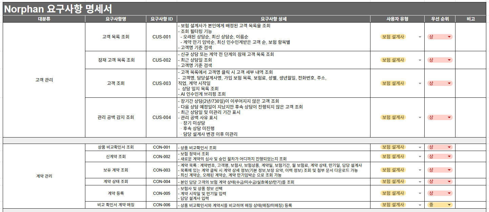

# Relia

# 팀원 소개

<table>
  
  <tr>
    <th>박선우</th>
    <th>김예지</th>
    <th>이용호</th>
    <th>조하은</th>
    <th>한규진
  </tr>
  
  <tr>
    <td align="center"></td>
    <td align="center"></td>   
    <td align="center"></td>   
    <td align="center"></td>  
    <td align="center"></td>   
  </tr>

  <tr>
    <td align="center">
      
    </td> 
    <td align="center">
      
    </td>
    <td align="center">
      
    </td>
    <td align="center">
      
    </td>
    <td align="center">
      
    </td>
  </tr>
</table>

  

---

# 목차
 

1. [프로젝트 기획서](#1--프로젝트-기획서)
2. [WBS](#2--WBS)
3. [요구사항 명세서](#3--요구사항-명세서)
4. [ERD](#4--erd)
5. [테이블 명세서](#5--테이블-명세서)
6. [시스템 아키텍처](#6--시스템-아키텍처)
7. [API 명세서](#7--api-명세서)
8. [화면설계서](#8--화면설계서)

 

---

# 1.  프로젝트 기획서
 
🔗[ 프로젝트 기획서 ](https://northern-mongoose-47b.notion.site/Norphan-367d351413c080d0a28cdc925cefcde4)
   

---

# 2.  WBS
 
🔗[ WBS ](https://docs.google.com/spreadsheets/d/1_25LySE-rzxbZtjh1W5OwWTwqWKSgGlhcC5KLCODOp4/edit?gid=1646305565#gid=1646305565)
   

---

# 3.  요구사항 명세서
 
🔗[ 요구사항 명세서 ](https://docs.google.com/spreadsheets/d/1_25LySE-rzxbZtjh1W5OwWTwqWKSgGlhcC5KLCODOp4/edit?gid=0#gid=0)
   

---

# 4.  ERD
🔗[ ERD ](https://www.erdcloud.com/d/bT8LAgzBFbTcFFipj)

   

---

# 5.  테이블 명세서
🔗[ 테이블 명세서 ](https://docs.google.com/spreadsheets/d/1_25LySE-rzxbZtjh1W5OwWTwqWKSgGlhcC5KLCODOp4/edit?gid=1990121092#gid=1990121092)
   

---

# 6.  시스템 아키텍처
 
🔗[ 시스템 아키텍처 ](https://github.com/beyond-sw-camp/be25-fin-Linker-Norphan-be/blob/main/docs/images/%EC%8B%9C%EC%8A%A4%ED%85%9C_%EC%95%84%ED%82%A4%ED%85%8D%EC%B2%98.png)
   

---
# 7.  API 명세서
🔗[ API 명세서 ](https://playdatacademy.notion.site/36fd943bcac28023a4a7d5e34e94fd8c?v=370d943bcac28007a5fb000cf2e7015e)
   

---

# 8.  화면설계서
🔗[ 화면설계서 ](https://www.figma.com/design/6aXsWd1dgv2FIWskBVlJQL/Norphan%EC%B4%88%EC%95%88?node-id=0-1&t=SD1UjxoCclMrT08R-1)

   
